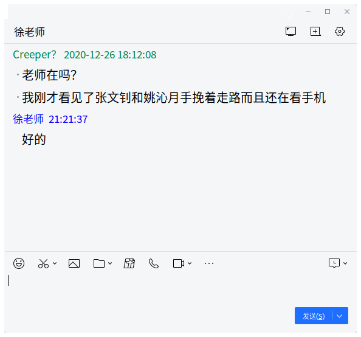

# *End Of Relation*

## 声明

本文档(EOR)隐形包含End Of Supporting(EOS)、Re-examining Of Prejudices(ROP)仅适用与王晨熙、吴梦涛、张文钊等3人。

任何人都可以查看此文章，不过转载需标明作者（Ye_Tianshun）和原文章的URL

**此外，本文章是在当事人*同意*的情况下编写的：**


## 常见问题及解答（FAQ）

### 1. 事情怎么会发展成这样呢？

​	从2020年10月内，你们曾多次触犯我的底线。在2020年11月到今天`2020-12-19`我暗地做了许多动作，以让事情在期待的情况下发生。

​	此外，根据分析，你们的

### 2. 王晨熙做了什么？

#### 1. 恶意做弄我

​	上课认真听讲被旁边人恶搞一下，走路走的好好的被人绊一下，这不好受吧。如果你说我也绊了别人，请你好好想一下我有没有在特殊场合下绊别人。

​	**还有，你是得了青春型精神病吗？和谁关系好就到处摸，注不注意形象了？**

#### 2. 说我坏话

​	这个就不谈了好吧

#### 3. 不认真学习

​	表面上看，王晨熙是一个热爱学习的学生。但实际上，王晨熙除了语文啥都比别人差。来看看她在2020年12月17日部分学校联合考试时的成绩：

```javascript
let studentInfo = {
    name: "王晨熙",
    examinations: [
        {
            name: "武汉市洪山区部分中学九年级十二月月考（联考）",
            date: new Date("2020-12-17"),
            results: [ //预测结果，可能不准
                {
                    name: "全科",
                    percent: 0.59,
                    value: 306
                },
                {
                    name: "语文",
                    percent: 0.55
                    value: 66
                },
                {
                    name: "数学",
                    percent: 0.4,
                    value: 48
                },
                {
                    name: "英语",
                    percent: 0.7,
                    value: 84
                },
                {
                    name: "物化综合",
                    percent: 0.68,
                    value: 82,
                    innerSubjects: [
                        {
                            name: "物理",
                            percent: 0.81,
                            value: 57
                        },
                        {
                            name: "化学",
                            percent: 0.5,
                            value: 25
                        }
                    ]
                },
                {
                    name: "政治",
                    percent: 0.65
                    value: 26
                }
            ]
        }
    ]
}
```

**考这么差你也配？我是真的不愿意和这样的人有任何关系。**

### 3. ~~Deleted~~

### 4. 吴梦涛和张文钊做了什么？

​	情况也和王晨熙差不多，总是说我坏话干嘛？你嫉妒我的成绩那你自己就好好学啊，诽谤他人又怎么说？

#### 看看吴梦涛的成绩

```javascript
let studentInfo = {
    name: "吴梦涛",
    examinations: [
        {
            name: "武汉市洪山区部分中学九年级十二月月考（联考）",
            date: new Date("2020-12-17"),
            results: [ //预测结果，可能不准
                {
                    name: "全科",
                    percent: 0.65,
                    value: 339
                },
                {
                    name: "语文",
                    percent: 0.54
                    value: 65
                },
                {
                    name: "数学",
                    percent: 0.56,
                    value: 67
                },
                {
                    name: "英语",
                    percent: 0.7,
                    value: 84
                },
                {
                    name: "物化综合",
                    percent: 0.77,
                    value: 92,
                    innerSubjects: [
                        {
                            name: "物理",
                            percent: 0.96,
                            value: 67
                        },
                        {
                            name: "化学",
                            percent: 0.50,
                            value: 25
                        }
                    ]
                },
                {
                    name: "政治",
                    percent: 0.78
                    value: 31
                }
            ]
        }
    ]
}
```

#### 张文钊的成绩

​	数据库无数据


### 5. 这件事情和姚沁月有什么关系？

​	相当于一个正面buff。为使张文钊恼火，我分析了和他关联的人，发现姚沁月和张文钊的相对关系值远高于其他人。后来调查到了他和姚沁月在交往，找到了激怒他的好机会。相关信息如下：

```javascript
let studentInfo = {
    name: "姚沁月",
    relation: [
        {
            studentName: "张文钊",
            relativeValue: -5 //由统计+计算获得的数据，可能不准
        },
        {
            studentName: "王晨熙",
            relativeValue: -13
        },
        {
            studentName: "赵欣宇",
            relativeValue: -16
        }
        //...
    ]
}
```

​	此外，姚沁月只配做工具人

#### 对于成绩

​	数据库无数据

### 6.为什么决裂文档在两月后才会发出来？

​	主要还是没时间。又要上学，又在做项目[*True Minecraft in C#*](https://dev.azure.com/yts233/_git/Minecraft )，又收集统计你们的数据，没时间发这玩意。

### 7. 发生了这么多事情为什么你看起来没事？

​	我是面向对象的人，关于我的大概实现如下：

```csharp
using Society;
using Student;
using Professions.IT;

[GoodAt(typeof(Math))]
[GoodAt(typeof(English))]
[GoodAt(typeof(Physics))]
[GoodAt(typeof(Chemistry))]
[HighAbility]
class Ye_Tianshun : People, IStudent, IProgrammer
{
    public string Name => "Ye_Tianshun";
    //...
    private Dictionary<People,Character> characters;
    public Character { get; private set; }
    protected override OnMeetPeople(People people)
    {
        if (!characters.ContainsKey(people))
            characters.Add(people, new Character(Character.Normal));
        this.SetCharacter(characters[people]);
        this.GreetOther(people);
        //...
    }
    //...
}
```

​	我在遇到每个人都会换一个情绪，这你就懂了吧。

### 8. 决裂以后我该怎么做？

​	我已和你们断绝任何关系，所以不要找我讲话；遇到问题查百度，别找我；不要把我的成绩和你们比较，你们不配。

## 12月26日添加问题（FAQ）

​	*添加关于黑名单和不良学生评判问题*

### 1. 什么是黑名单？

​	简单来说就是一个表（Table）

| 表项      | 类型         | 注释                     |
| --------- | ------------ | ------------------------ |
| Id        | int          | 黑名单成员的标识符（ID） |
| PersonId  | int          | 认识人员的标识符（ID）   |
| Reason    | nvarchar(20) | 进入黑名单的原因         |
| StartTime | date         | 进入黑名单的时间         |
| Power     | int          | 黑名单内的权重           |

​	此外这个表还有一个对应的视图（View）

| 表项       | 类型         | 注释                      |
| ---------- | ------------ | ------------------------- |
| Id         | int          | 黑名单成员的标识符（ID）  |
| PersonId   | int          | 人的标识符（ID）          |
| PersonName | nvarchar(5)  | 人的名字                  |
| Reason     | nvarchar(20) | 进入黑名单的原因          |
| StartTime  | date         | 进入黑名单的时间          |
| Power      | int          | 黑名单内的权重（总小于0） |

​	在黑名单内的成员是无法或限制被我提供帮助和技术支持的。

### 2. 我们在黑名单内是怎样的？

​	隐私原因，无法把整个黑名单放出。以下为部分人员的信息：

| Id   | PersonId | PersonName  | Reason      | StartTime  | Power |
| ---- | -------- | ----------  | ----------- | ---------- | ----- |
| 35   | 27       | 王晨熙       | 不良学生     | 2020-12-19 | -1    |
| 36   | 31       | 姚沁月       | 不良学生     | 2020-12-19 | -50   |
| 37   | 27       | 吴梦涛       | 不良学生     | 2020-12-19 | -31   |
| 38   | 19       | ~~Deleted~~ | ~~Deleted~~ | ~~2020-12-19~~ | ~~-99~~   |
| 39   | 35       | 张文钊       | 掀桌子       | 2019-04-26 | -27   |

### 3.  “不良学生” 是什么？

​	根据行为判断是否为不良学生。老师无法管理的，老师总是批评的和扰乱秩序的直接视为不良学生。

​	为了确保真实性，我特地多次目击举报，老师均回复`好的`。由此得出老师管不了这两位学生，所以姚沁月被记录为`不良学生`

​	最近一次举报记录（之前因配置Wine导致聊天记录全部丢失）如下：



### 4. 为什么张文钊没有 “不良学生” Tag ？

​	旧数据已归档且无法重复添加数据。

### 5. 权重高意味着什么？

​	权重高意味着我对你有偏见，你会被我针对并很难从我这里获取帮助和技术支持。

### 6. 如何降低我在黑名单内的权重？

​	如果你转变态度，认真学习，让我刮目相看，我可能会降低你的权重。

## 关于此文档的状态

​	此文档在`2020-12-26 21:26`完成编辑并归档，将不再添加或修改内容了。

## 额外信息

​	如果你有任何不明白的地方，请给<admin@yts233.tk>发邮件，我不接受任何其他的联络方式。

#### 以下内容针对游客

​	写完这篇文档我又要去写[*Minecraft（C#）*](https://yts233.visualstudio.com/_git/Minecraft )项目了，我的计划堆得真密！

​	请在评论区发表自己对此看法吧  : D